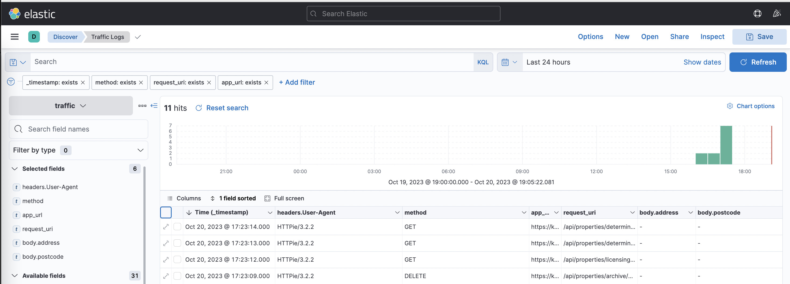

# Go Traffic Capture

A simple Go server to capture traffic and send it to Elasticsearch. The main idea is that
when mirroring traffic, it'll allow you to capture the body and headers for monitoring
or replaying events against a test environment.



## Toolset

- [DB Snapshot Replication](https://github.com/gemmadlou/go-db-snapshot-replication)
- [Traffic Capture](https://github.com/gemmadlou/go-traffic-capture)
- [Traffic Replay](https://github.com/gemmadlou/go-traffic-replay)

## Usage

Set up environment variables.

```bash
cp .env.example .env
```

Setup local ES server.

```bash
docker compose up -d
```

Start Go server.

```bash
go run main.go

# Development server
nodemon --exec go run main.go --signal SIGTERM
```

Send test request to Go server

```bash
# Using httpie
http http://localhost:9990/eskimo data=123 pet=cat 'Cookie: Monster'  
```

## Authentication

Only Basic auth is configurable.

```bash
AUTH=basic
AUTH_USERNAME=username
AUTH_PASSWORD=password
```

## Running the Dockerised app

Build the docker container

```bash
docker build . -t go-traffic-capture
```

Run the dockerised app.

```bash
docker run --rm -p 9990:9990 \
    --env-file ./.env \
    -e ENVIRONMENT=production \
    go-traffic-capture
```

## Nginx Mirror Config

The mirrored service requires its own block:

```nginx
location = /mirror {
    internal;
    proxy_pass http://127.0.0.1:9990$request_uri;
}
```

The mirror directive needs to go into the location block that points to the application. Here's a PHP example:

```nginx
location ~ \.php$ {
    mirror /mirror;
```

Here's a full example with a PHP Laravel reverse proxy that uses fastcgi.

```nginx
server {
    listen 80;
    index index.php index.html;
    server_name localhost;

    error_log  /var/log/nginx/error.log;
    access_log /var/log/nginx/access.log;

    root /code/public;

    location / {
        try_files $uri $uri/ /index.php?$query_string;
        gzip_static on;
    }

    location ~ \.php$ {
        mirror /mirror;
        try_files $uri =404;
        fastcgi_split_path_info ^(.+\.php)(/.+)$;
        fastcgi_pass localhost:9000;
        fastcgi_index index.php;
        include fastcgi_params;
        fastcgi_param SCRIPT_FILENAME $document_root$fastcgi_script_name;
        fastcgi_param PATH_INFO $fastcgi_path_info;
    }

    location = /mirror {
        internal;
        proxy_pass http://127.0.0.1:9990$request_uri;
    }
}
```


## Resources

- Http server - https://www.digitalocean.com/community/tutorials/how-to-deploy-a-go-web-application-using-nginx-on-ubuntu-18-04
- Maps in golang. https://gobyexample.com/maps
- Elasticsearch setup. https://geshan.com.np/blog/2023/06/elasticsearch-docker/
```bash
# Create index
curl -X PUT http://localhost:9200/traffic

# Create example traffic
curl -X POST -H 'Content-Type: application/json' -d '{ "request_uri": "/hello-world", "base_url": "https://example.com", "headers": [], "body": {} }' http://localhost:9200/traffic/_doc

# Get traffic
curl -X GET "localhost:9200/traffic/_search"
```
- Create json data. https://www.digitalocean.com/community/tutorials/how-to-use-json-in-go
- https://christiangiacomi.com/posts/simple-put-patch-request-go/
- https://opster.com/guides/elasticsearch/how-tos/elasticsearch-delete-index/
```bash
curl -X DELETE "http://localhost:9200/traffic"
```
- https://www.alexedwards.net/blog/basic-authentication-in-go
- Timestamp. https://yourbasic.org/golang/current-time/
- Elastcsearh data format. https://stackoverflow.com/questions/38790030/elasticsearch-date-format
- Dockering Go. https://docs.docker.com/language/golang/build-images/
- Publish Docker onto GitHub packages. https://docs.github.com/en/actions/publishing-packages/publishing-docker-images#publishing-images-to-github-packages